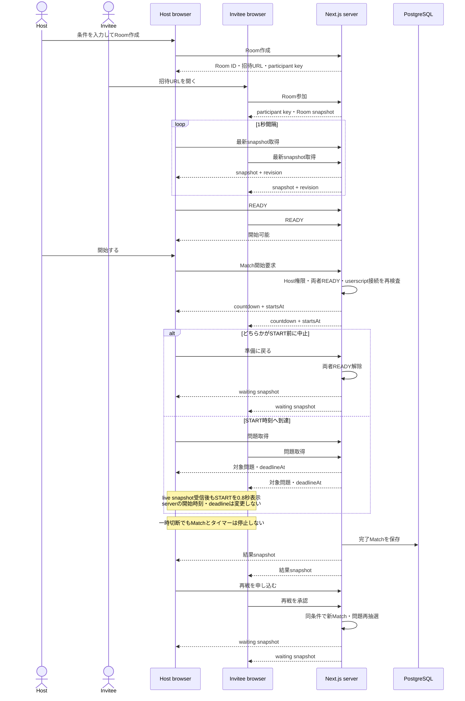

# Room作成から再戦まで

## 失敗時の補足

- snapshot取得が3秒失敗した画面は共有操作を無効にし、復旧後に最新snapshot全体を取得する。
- 古いrevisionの応答は新しい状態を上書きしない。
- Inviteeの明示的退出は席を解放し、ホストの明示的終了はRoomを閉じる。
- Waiting中はホストも確認モーダルからInviteeの席を解放できる。Countdown開始後と対戦中は実行できない。
- 対戦中ではなく両者無接続のRoomは30分後に閉じる。
- `3 → 2 → 1 → START`の後は、問題・制限時間のserver上の開始を遅らせず、clientのSTART表示だけ0.8秒保持する。
