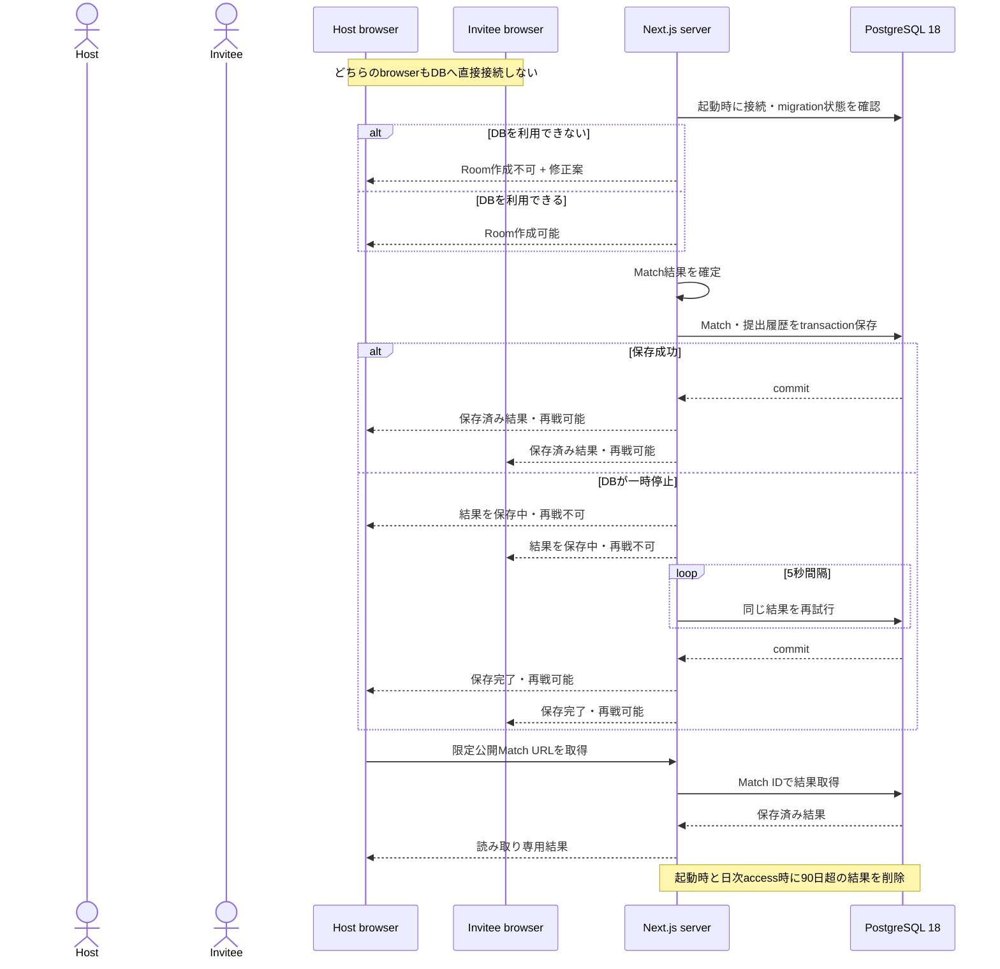

# Match結果の保存と再表示

```mermaid
sequenceDiagram
    actor Host
    actor Invitee
    participant HostWeb as Host browser
    participant InviteeWeb as Invitee browser
    participant Server as Next.js server
    participant DB as PostgreSQL 18

    Note over HostWeb,InviteeWeb: どちらのbrowserもDBへ直接接続しない
    Server->>DB: 起動時に接続・migration状態を確認

    alt DBを利用できない
        Server-->>HostWeb: Room作成不可 + 修正案
    else DBを利用できる
        Server-->>HostWeb: Room作成可能
    end

    Server->>Server: Match結果を確定
    Server->>DB: Match・提出履歴をtransaction保存

    alt 保存成功
        DB-->>Server: commit
        Server-->>HostWeb: 保存済み結果・再戦可能
        Server-->>InviteeWeb: 保存済み結果・再戦可能
    else DBが一時停止
        Server-->>HostWeb: 結果を保存中・再戦不可
        Server-->>InviteeWeb: 結果を保存中・再戦不可
        loop 5秒間隔
            Server->>DB: 同じ結果を再試行
        end
        DB-->>Server: commit
        Server-->>HostWeb: 保存完了・再戦可能
        Server-->>InviteeWeb: 保存完了・再戦可能
    end

    HostWeb->>Server: 限定公開Match URLを取得
    Server->>DB: Match IDで結果取得
    DB-->>Server: 保存済み結果
    Server-->>HostWeb: 読み取り専用結果

    Note over Server,DB: 起動時と日次access時に90日超の結果を削除
```

## 失敗時の補足

- 保存前にNext.js server processが終了すると、未保存結果は日曜デモでは失われる。
- VOIDは原因付きで保存するが、直近の対戦や勝敗数には含めない。
- 期限切れ結果URLには削除済みであることを表示し、Room IDから推測できるURLは使わない。
