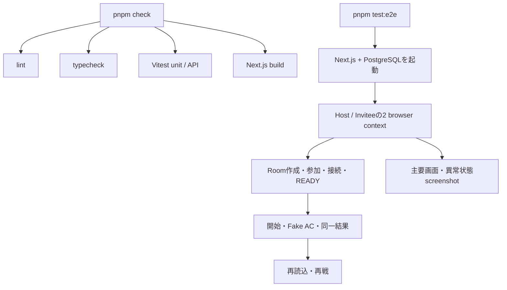

# 日曜デモの検証

## 自動検証

## 手動リハーサル

1. ホストPCでPostgreSQL、migration、Next.js serverを起動する。
2. LAN上の2端末から同じserverへ接続する。
3. ChromeまたはEdgeへTampermonkey userscriptをインストールする。
4. 各本人がAtCoderへログインし、プロフィールIDとの一致とheartbeatを確認する。
5. Room作成、招待、READY、ホスト開始、問題公開を確認する。
6. 対象問題へ実提出し、Pending submission、最終判定、両画面の同一結果を確認する。
7. 短時間の通信切断後に再送と最新snapshotへの復帰を確認する。
8. server再起動後、限定公開Match URLで保存結果を再表示する。

実AtCoderデータは`Litms`およびその場で明示的に許可された友人の提出だけを使い、ソースコード本文は取得・保存しません。
