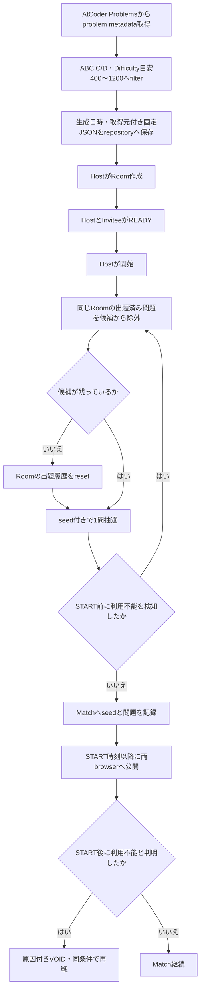

# 問題データ生成とMatch抽選

```mermaid
flowchart TD
    A[AtCoder Problemsからproblem metadata取得] --> B[ABC C/D・Difficulty目安400〜1200へfilter]
    B --> C[生成日時・取得元付き固定JSONをrepositoryへ保存]
    C --> D[HostがRoom作成]
    D --> E[HostとInviteeがREADY]
    E --> F[Hostが開始]
    F --> G[同じRoomの出題済み問題を候補から除外]
    G --> H{候補が残っているか}
    H -- いいえ --> I[Roomの出題履歴をreset]
    I --> J[seed付きで1問抽選]
    H -- はい --> J
    J --> K{START前に利用不能を検知したか}
    K -- はい --> G
    K -- いいえ --> L[Matchへseedと問題を記録]
    L --> M[START時刻以降に両browserへ公開]
    M --> N{START後に利用不能と判明したか}
    N -- はい --> O[原因付きVOID・同条件で再戦]
    N -- いいえ --> P[Match継続]
```

## デモ後

- AtCoder Problemsのmetadataを定期的にCustom Contestへ取り込み、DB cacheから抽選する。
- 取込先が一時停止しても最後に成功したcacheを使う。
- 両ParticipantのAC済み問題を除外する設定は、提出履歴の取得境界と一緒に再Grillingする。
