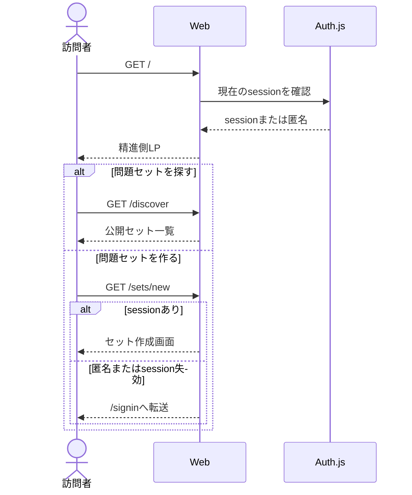

# 精進側LPからの入口

公開前の主導線は問題セットの発見・作成。匿名利用者は公開セットを閲覧でき、作成はOAuthログイン後に行う。

```mermaid
sequenceDiagram
  actor Visitor as 訪問者
  participant Web as Web
  participant Auth as Auth.js
  Visitor->>Web: GET /
  Web->>Auth: 現在のsessionを確認
  Auth-->>Web: sessionまたは匿名
  Web-->>Visitor: 精進側LP
  alt 問題セットを探す
    Visitor->>Web: GET /discover
    Web-->>Visitor: 公開セット一覧
  else 問題セットを作る
    Visitor->>Web: GET /sets/new
    alt sessionあり
      Web-->>Visitor: セット作成画面
    else 匿名またはsession失効
      Web-->>Visitor: /signinへ転送
    end
  end
```

対戦画面のURLはDiscoverへ転送し、対戦APIは本番の機能境界で404を返す。LPは対戦への公開導線を持たない。
