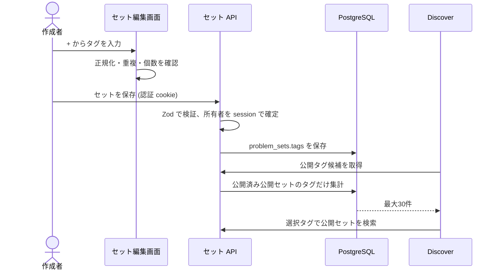

# 自由入力セットタグ

```mermaid
sequenceDiagram
  actor Author as 作成者
  participant Editor as セット編集画面
  participant API as セット API
  participant DB as PostgreSQL
  participant Discover as Discover
  Author->>Editor: + からタグを入力
  Editor->>Editor: 正規化・重複・個数を確認
  Author->>API: セットを保存 (認証 cookie)
  API->>API: Zod で検証、所有者を session で確定
  API->>DB: problem_sets.tags を保存
  Discover->>API: 公開タグ候補を取得
  API->>DB: 公開済み公開セットのタグだけ集計
  DB-->>Discover: 最大30件
  Discover->>API: 選択タグで公開セットを検索
```
