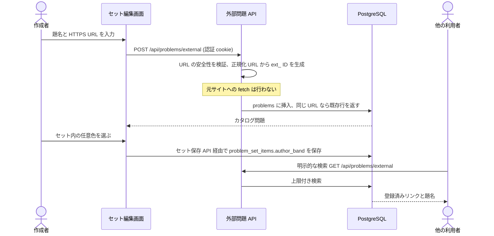

# 外部問題リンクの登録・再利用

```mermaid
sequenceDiagram
  actor Author as 作成者
  participant Editor as セット編集画面
  participant API as 外部問題 API
  participant DB as PostgreSQL
  actor Other as 他の利用者
  Author->>Editor: 題名と HTTPS URL を入力
  Editor->>API: POST /api/problems/external (認証 cookie)
  API->>API: URL の安全性を検証、正規化 URL から ext_ ID を生成
  Note over API: 元サイトへの fetch は行わない
  API->>DB: problems に挿入、同じ URL なら既存行を返す
  DB-->>Editor: カタログ問題
  Author->>Editor: セット内の任意色を選ぶ
  Editor->>DB: セット保存 API 経由で problem_set_items.author_band を保存
  Other->>API: 明示的な検索 GET /api/problems/external
  API->>DB: 上限付き検索
  DB-->>Other: 登録済みリンクと題名
```
