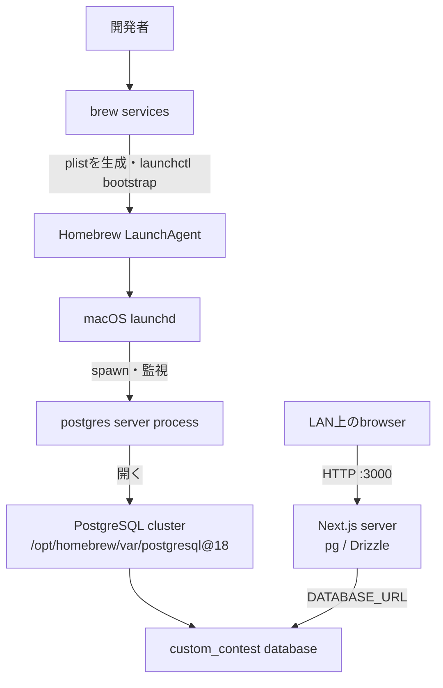

# Custom ContestのローカルPostgreSQLを診断する

[視覚版で流れを復習する](visuals/postgresql-local-service.html)

## 30秒まとめ

今回のdata directoryやPostgreSQL 18.3は壊れていなかった。`createdb`がconnection refusedになった直接原因は、5432で`postgres`が動いていなかったことだった。

`brew services start`はLaunchAgentの登録には成功したが、macOSのlaunchdは次の理由で実プロセスのspawnを保留していた。

```text
pending spawn, domain in on-demand-only mode: homebrew.mxcl.postgresql@18
```

そのためHomebrewは`other`、`pg_ctl status`は`no server running`になった。登録済みjobを`launchctl kickstart`で明示起動すると、Homebrew管理のPIDで正常に起動した。

```sh
launchctl kickstart -p "gui/$(id -u)/homebrew.mxcl.postgresql@18"
```

現在はPostgreSQL 18.3、`custom_contest`、migration、localhost/LANのapplication healthまで正常である。未確定なのは、今回のmacOS GUI sessionがon-demand-only modeになったさらに上流のOS内部トリガーだけである。

## 最終的な構造



この図で重要なのは、Homebrew service definitionはdatabase serverそのものではないことと、clusterとdatabaseが別物であること。

- `launchd`はmacOSのprocess manager。
- LaunchAgent plistは、何をどの引数で起動するかという定義。
- `postgres`は実際に5432をlistenし、clusterを開くserver process。
- clusterは1つのdata directory全体で、複数のdatabaseを含む。
- `custom_contest`はcluster内に作った1つのdatabase。
- LANへ公開するのはNext.jsの3000番であり、PostgreSQLの5432番ではない。

`pg_ctl`はこの流れの別入口である。`postgres`を直接安全に開始・停止・確認できるが、Homebrew/launchd管理と同時に使うと「誰がprocessを管理しているか」が曖昧になる。

## コマンドの役割

| Program | Layer | 何をするか | 今回の見方 |
| --- | --- | --- | --- |
| `postgres` | PostgreSQL server | `-D`で指定したclusterを開き、接続を受ける | plistは`postgres -D /opt/homebrew/var/postgresql@18`を実行する |
| `pg_ctl` | PostgreSQL process control | `postgres`のstart/stop/statusをdata directory単位で扱う | 直接起動できたため、binaryとclusterが正常だと分かった |
| `psql` | SQL client | serverへ接続し、SQLを送る | `-d postgres`で保守用DB、`-d custom_contest`でProject DBへ接続した |
| `createdb` | SQL client wrapper | serverへ接続して`CREATE DATABASE`を発行する | clusterは作らず、cluster内に`custom_contest`だけを作った |
| `pg_isready` | Connection probe | serverが接続受付中かをexit status付きで確認する | `accepting connections`がprocess/port確認、SQLの正しさは`psql`で別確認する |
| `brew services` | Homebrew integration | plistを生成し、macOSでは`launchctl`を呼ぶ | “Successfully started”はbootstrap成功で、今回のように実PIDがない場合もある |
| `launchd` | macOS service manager | 登録されたjobをspawn・監視する | 今回はjobを登録したがon-demand-only modeでspawnを保留した |
| `launchctl` | launchd client | launchdの登録、状態表示、明示起動を行う | `print`で事実を読み、`kickstart`で登録済みjobを起動した |

### よく使った引数

- `-D /opt/homebrew/var/postgresql@18`: 対象clusterのdata directory。
- `-d postgres`: 接続先databaseを明示。省略するとOSユーザー名`keita`が既定database名になり、存在しなければ`database "keita" does not exist`になる。
- `-X`: `psql`の個人startup fileを読まず、診断を再現しやすくする。
- `-v ON_ERROR_STOP=1`: SQL errorが出たら非zeroで終了する。
- `-Atc`: 見出しなし・整形なしで、指定した1つのSQLを実行する。
- `pg_ctl stop -m fast -w`: 新規接続を止め、既存接続を終了し、整合性を保って停止完了まで待つ。今回はHomebrew管理外で直接動いていたprocessの停止に使った。
- `launchctl kickstart -p`: 登録済みserviceを起動条件に関係なく即時起動し、PIDを表示する。

## 実際の原因と証拠

### 1. Installationとclusterは正常だった

```text
Homebrew prefix: /opt/homebrew
PostgreSQL: 18.3 (Homebrew), arm64
data directory: /opt/homebrew/var/postgresql@18
PG_VERSION: 18
owner/mode: keita / 0700
pg_control state: in production
```

`PG_VERSION`、`postgresql.conf`、`pg_hba.conf`、`pg_control`が揃い、`pg_ctl`による直接起動と自動recoveryにも成功した。したがって、再installや`initdb`を行う根拠はなかった。

### 2. `brew services`の`other`はDB破損を意味しなかった

Homebrewのstatus判定では、今回の状態は次の組み合わせだった。

```text
Loaded: true
PID: none
last exit code: none
```

この「登録済みだがrunning/stopped/errorのどれにも分類できない」状態が`other`だった。`Schedulable: false`は障害ではなく、時刻指定serviceではないという意味である。

### 3. launchdが自動spawnを保留していた

LaunchAgentが実行しようとしていた正確なcommandは次だった。

```sh
/opt/homebrew/opt/postgresql@18/bin/postgres \
  -D /opt/homebrew/var/postgresql@18
```

しかし`launchctl print`は`runs = 0`、`state = not running`で、macOS統合ログにはon-demand-only modeによるpending spawnが記録されていた。`brew services start`はplistのbootstrap成功を報告しただけで、実際のreadinessまでは確認していなかった。

### 4. 直前のshutdownも完全には正常終了していなかった

`brew services stop`でlaunchdがSIGTERMを送ると、PostgreSQLはsmart shutdownを開始した。既存接続を待って5秒以内に終了せず、launchdがSIGKILLした。そのため次回の直接起動時にautomatic recoveryが走ったが、recoveryは成功し、data corruptionの証拠はなかった。

### 5. 最小修正

Homebrewのplistを編集せず、登録済みjobを明示起動した。

```sh
launchctl kickstart -p "gui/$(id -u)/homebrew.mxcl.postgresql@18"
```

結果は次のとおり。

```text
brew services list: started
launchctl: state = running, PIDあり
pg_ctl status: server is running
pg_isready -d postgres: accepting connections
psql custom_contest: 接続成功
```

## 診断コマンドをどう読むか

| Command | 読む/変える状態 | 成功 | 典型的な失敗の意味 |
| --- | --- | --- | --- |
| `brew --prefix postgresql@18` | Homebrew installationを読む | `/opt/homebrew/opt/postgresql@18` | formula未install、または別architectureのHomebrew |
| `pg_controldata DATA_DIR` | cluster metadataを読む | version/state/checkpointが表示 | directory違い、権限問題、未初期化または破損 |
| `pg_ctl -D DATA_DIR status` | `postmaster.pid`とprocessを読む | PIDとcommandが表示 | server停止、data directory違い、stale PIDの可能性 |
| `lsof -nP -iTCP:5432 -sTCP:LISTEN` | portを読む | `postgres`がLISTEN | 空ならserver停止、別processならport競合 |
| `pg_isready -d postgres` | 接続受付状態を読む | exit 0 / accepting | rejectingは起動途中、no responseはprocess・port・socketを再確認 |
| `psql -X -d postgres -c 'select 1'` | 実SQL接続を読む | 1行返る | role、認証、database名、server接続のどこか |
| `plutil -p ~/Library/LaunchAgents/homebrew.mxcl.postgresql@18.plist` | LaunchAgent定義を読む | ProgramArgumentsが見える | plist欠落・壊れ・想定外data directory |
| `launchctl print gui/UID/homebrew.mxcl.postgresql@18` | launchdの実状態を読む | running、PID、runsが見える | not runningならログとlast exitを確認 |
| `tail /opt/homebrew/var/log/postgresql@18.log` | PostgreSQLログを読む | ready行または具体的error | data directory、port競合、PID、recoveryの手掛かり |

## 次回のトラブルシューティング順

```text
ApplicationがDBへ接続できない
  ↓
1. binary/versionは正しいか
   command -v postgres && postgres --version
  ↓
2. Homebrewの登録状態と実PIDは一致するか
   brew services list
   launchctl print gui/$(id -u)/homebrew.mxcl.postgresql@18
  ↓
3. postgresは5432/socketをlistenしているか
   pg_ctl -D /opt/homebrew/var/postgresql@18 status
   lsof -nP -iTCP:5432 -sTCP:LISTEN
   pg_isready -d postgres
  ↓
4. SQL接続とroleは正常か
   psql -X -d postgres -c 'select current_user, current_database();'
  ↓
5. custom_contestは存在するか
   psql -X -d postgres -Atc "select 1 from pg_database where datname='custom_contest';"
  ↓
6. .env.localは正しいか
   DATABASE_URL=postgresql://localhost:5432/custom_contest
  ↓
7. migrationは適用済みか
   pnpm db:migrate
   psql -X -d custom_contest -c 'table custom_contest_migrations;'
  ↓
8. HTTP application全体は正常か
   curl http://localhost:3000/api/health
```

現在の`apps/web/scripts/migrate.ts`は、未適用fileを別に選別するrunnerではない。`CREATE TABLE IF NOT EXISTS`と`ON CONFLICT DO NOTHING`を含む同じSQLを毎回実行する形で再実行可能になっている。そのため、変更が0件でも`applied 0001_match_results`と表示される。実際の適用状態は`custom_contest_migrations`を読んで確認する。

`brew services start`が成功表示なのに`pg_isready`が失敗したら、成功表示だけを信じず、次を確認する。

```sh
launchctl print "gui/$(id -u)/homebrew.mxcl.postgresql@18"
/usr/bin/log show --last 10m --style compact \
  --predicate 'process == "launchd"' | rg 'homebrew.mxcl.postgresql@18'
```

今回と同じ`pending spawn, domain in on-demand-only mode`で、jobがloaded済みなら次で起動する。

```sh
launchctl kickstart -p "gui/$(id -u)/homebrew.mxcl.postgresql@18"
```

## 危険な近道

- data directoryを削除しない。そこには全database、WAL、role、cluster設定がある。
- 初期化済みの`/opt/homebrew/var/postgresql@18`へ`initdb`しない。`initdb`はdatabaseを1つ追加するコマンドではなく、新しいcluster全体を作るコマンド。
- processが本当に停止したと証明する前に`postmaster.pid`やsocketを消さない。今回のPID/socketはstaleではなかった。
- `kill -9 postgres`を通常の停止手段にしない。今回も強制終了後にautomatic recoveryが必要になった。
- user所有clusterを安易に`sudo brew services start`しない。root起動やownership不一致という別問題を作り得る。
- Homebrew管理中のserverと、`pg_ctl start`で直接起動したserverを同時に持たない。port競合だけでなく、どちらが停止・再起動するか分からなくなる。
- LANへPostgreSQL 5432を公開しない。このProjectで外部PCに必要なのはNext.jsの3000番だけ。

## 日曜LANデモの起動手順

```sh
cd ~/repos/Custom-Contest
nvm use 24.19.0
node --version # v24.19.0
pnpm --version # 11.19.0

brew services start postgresql@18
pg_isready -d postgres

# pg_isreadyが失敗し、launchctlでloadedだがPIDなしの場合だけ
launchctl kickstart -p "gui/$(id -u)/homebrew.mxcl.postgresql@18"

# 無ければ一度だけ作る
if ! psql -X -d postgres -Atc \
  "select 1 from pg_database where datname='custom_contest'" | rg -qx 1; then
  createdb custom_contest
fi

pnpm db:migrate
pnpm check

lan_ip="$(ipconfig getifaddr "$(route -n get default | awk '/interface:/{print $2; exit}')")"
CUSTOM_CONTEST_SERVER_ORIGIN="http://${lan_ip}:3000" pnpm userscript:build
pnpm dev -- --hostname 0.0.0.0
```

別terminalで確認する。

```sh
lan_ip="$(ipconfig getifaddr "$(route -n get default | awk '/interface:/{print $2; exit}')")"
curl http://localhost:3000/api/health
curl "http://${lan_ip}:3000/api/health"
```

両方がHTTP 200かつ`ok: true`なら、server → database → migration → problem poolの経路が通っている。

## 今回修正した理解

- `brew services start`の成功表示と、`postgres`のreadinessは別確認が必要。
- `database "keita" does not exist`はserver停止ではなく、省略されたdatabase名の既定値による接続先エラー。
- clusterの初期化、server processの起動、databaseの作成、migrationの適用は、それぞれ別の状態変更。
- PostgreSQLをLANへ公開する必要はない。Custom ContestのNext.js serverだけを`0.0.0.0:3000`でlistenする。

## Review questions

1. `brew services list`が`other`でも、なぜdata directory破損とは断定できないか。
2. `pg_isready`と`psql -c 'select 1'`はそれぞれ何を証明するか。
3. `createdb custom_contest`と`initdb -D ...`は、変更範囲がどう違うか。
4. LaunchAgentの`ProgramArguments`と実際のprocess PIDを、どの2つのコマンドで確認できるか。
5. LANデモで3000番は外部へlistenさせ、5432番はlocalhostのままでよいのはなぜか。
6. `brew services start`成功後に`pg_isready`が失敗した場合、次にどの層を見るべきか。

## 実測時点の未確定事項

macOS GUI launchd domainが今回on-demand-only modeへ入った、さらに上流のOS内部トリガーは確定していない。再発時も同じログかを確認し、異なるerrorなら`kickstart`を万能な解決策として使わず、そのerrorから診断をやり直す。

## References

- [Homebrew `services` command](https://docs.brew.sh/Manpage#services-subcommand)
- [PostgreSQL 18: `pg_ctl`](https://www.postgresql.org/docs/18/app-pg-ctl.html)
- [PostgreSQL 18: Creating a database](https://www.postgresql.org/docs/18/manage-ag-createdb.html)
- [PostgreSQL 18: `postgres`](https://www.postgresql.org/docs/18/app-postgres.html)
- `man launchctl`（`bootstrap`、`print`、`kickstart`のlocal manual）
